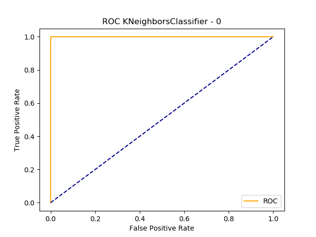
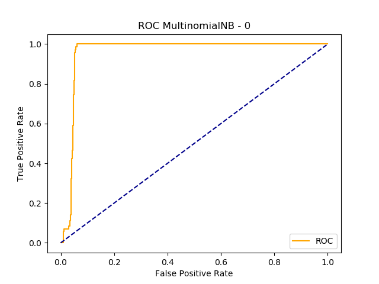
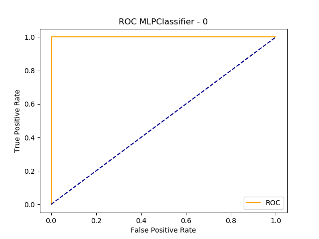

Comparaison des classifieurs
============================

Ces comparaisons ont été effectuées en utilisant les flows fournis au début de ce cours en vue de déterminer le meilleur classifieur.

## ICMP protocol

### K Nearest Neighbors 

Avec K = 5

```
accuracy 0.9988 time 10032ms false_positive   0 false_negative    2 recall 0.9841 prec 0.9994 F1 0.9916 AUC 1.0000 name KNeighborsClassifier-0
accuracy 0.9963 time 8137ms false_positive    2 false_negative    4 recall 0.9691 prec 0.9831 F1 0.9760 AUC 0.9848 name KNeighborsClassifier-1
accuracy 0.9988 time 9528ms false_positive    0 false_negative    2 recall 0.9833 prec 0.9994 F1 0.9912 AUC 0.9999 name KNeighborsClassifier-2
accuracy 0.9994 time 9767ms false_positive    0 false_negative    1 recall 0.9904 prec 0.9997 F1 0.9950 AUC 1.0000 name KNeighborsClassifier-3
accuracy 0.9988 time 9304ms false_positive    0 false_negative    2 recall 0.9815 prec 0.9994 F1 0.9902 AUC 0.9999 name KNeighborsClassifier-4
```



### Multinomial Naive Bayes 

```
accuracy 0.9560 time  157ms false_positive    0 false_negative   71 recall 0.5000 prec 0.4780 F1 0.4888 AUC 0.9575 name MultinomialNB-0
accuracy 0.9616 time  185ms false_positive    0 false_negative   62 recall 0.5000 prec 0.4808 F1 0.4902 AUC 0.9554 name MultinomialNB-1
accuracy 0.9591 time  220ms false_positive    0 false_negative   66 recall 0.5000 prec 0.4796 F1 0.4896 AUC 0.9644 name MultinomialNB-2
accuracy 0.9715 time  134ms false_positive    0 false_negative   46 recall 0.5000 prec 0.4858 F1 0.4928 AUC 0.9636 name MultinomialNB-3
accuracy 0.9690 time  149ms false_positive    0 false_negative   50 recall 0.5000 prec 0.4845 F1 0.4921 AUC 0.9670 name MultinomialNB-4

```



### Gaussian Naive Bayes 

```
accuracy 0.9975 time  902ms false_positive    4 false_negative    0 recall 0.9987 prec 0.9714 F1 0.9846 AUC 0.9987 name GaussianNB-0
accuracy 0.9975 time  695ms false_positive    4 false_negative    0 recall 0.9987 prec 0.9655 F1 0.9815 AUC 0.9987 name GaussianNB-1
accuracy 0.9994 time  654ms false_positive    1 false_negative    0 recall 0.9997 prec 0.9904 F1 0.9950 AUC 0.9997 name GaussianNB-2
accuracy 0.9988 time  630ms false_positive    2 false_negative    0 recall 0.9994 prec 0.9868 F1 0.9930 AUC 0.9994 name GaussianNB-3
accuracy 0.9988 time  649ms false_positive    2 false_negative    0 recall 0.9994 prec 0.9808 F1 0.9899 AUC 0.9994 name GaussianNB-4
```


### Multi Layer Perceptron 

Avec alpha = 1e-4, hidden_layer_sizes = (100,50) et random_state = 1

```
accuracy 0.9988 time 1802ms false_positive    2 false_negative    0 recall 0.9994 prec 0.9833 F1 0.9912 AUC 0.9999 name MLPClassifier-0
accuracy 1.0000 time 1277ms false_positive    0 false_negative    0 recall 1.0000 prec 1.0000 F1 1.0000 AUC 1.0000 name MLPClassifier-1
accuracy 1.0000 time  950ms false_positive    0 false_negative    0 recall 1.0000 prec 1.0000 F1 1.0000 AUC 1.0000 name MLPClassifier-2
accuracy 0.9994 time 1678ms false_positive    0 false_negative    1 recall 0.9914 prec 0.9997 F1 0.9955 AUC 1.0000 name MLPClassifier-3
accuracy 1.0000 time 1277ms false_positive    0 false_negative    0 recall 1.0000 prec 1.0000 F1 1.0000 AUC 1.0000 name MLPClassifier-4
```



## SMTP protocol

### K Nearest Neighbors 

Avec K = 5

```
accuracy 0.9993 time 1478ms false_positive    1 false_negative    0 recall 0.9997 prec 0.9545 F1 0.9760 AUC 1.0000 name KNeighborsClassifier-0
accuracy 0.9993 time 1428ms false_positive    0 false_negative    1 recall 0.9706 prec 0.9996 F1 0.9847 AUC 0.9704 name KNeighborsClassifier-1
accuracy 0.9986 time 1446ms false_positive    1 false_negative    1 recall 0.9733 prec 0.9733 F1 0.9733 AUC 0.9998 name KNeighborsClassifier-2
accuracy 0.9972 time 1459ms false_positive    2 false_negative    2 recall 0.9405 prec 0.9405 F1 0.9405 AUC 0.9701 name KNeighborsClassifier-3
accuracy 0.9986 time 1483ms false_positive    2 false_negative    0 recall 0.9993 prec 0.9286 F1 0.9612 AUC 1.0000 name KNeighborsClassifier-4
```

### Multinomial Naive Bayes 

```
accuracy 0.9875 time  119ms false_positive    0 false_negative   18 recall 0.5000 prec 0.4938 F1 0.4969 AUC 0.8799 name MultinomialNB-0
accuracy 0.9938 time  118ms false_positive    0 false_negative    9 recall 0.5000 prec 0.4969 F1 0.4984 AUC 0.9839 name MultinomialNB-1
accuracy 0.9903 time  115ms false_positive    0 false_negative   14 recall 0.5000 prec 0.4951 F1 0.4976 AUC 0.9913 name MultinomialNB-2
accuracy 0.9903 time  114ms false_positive    0 false_negative   14 recall 0.5000 prec 0.4951 F1 0.4976 AUC 0.9192 name MultinomialNB-3
accuracy 0.9861 time  111ms false_positive    0 false_negative   20 recall 0.5000 prec 0.4931 F1 0.4965 AUC 0.9793 name MultinomialNB-4

```

### Gaussian Naive Bayes 

```
accuracy 0.9606 time  258ms false_positive   57 false_negative    0 recall 0.9801 prec 0.5870 F1 0.6380 AUC 0.9805 name GaussianNB-0
accuracy 0.9695 time  264ms false_positive   42 false_negative    2 recall 0.9264 prec 0.6309 F1 0.6949 AUC 0.9264 name GaussianNB-1
accuracy 0.9889 time  258ms false_positive   15 false_negative    1 recall 0.9590 prec 0.7318 F1 0.8067 AUC 0.9574 name GaussianNB-2
accuracy 0.9598 time  255ms false_positive   58 false_negative    0 recall 0.9796 prec 0.6282 F1 0.6937 AUC 0.9796 name GaussianNB-3
accuracy 0.9417 time  261ms false_positive   84 false_negative    0 recall 0.9706 prec 0.5625 F1 0.5960 AUC 0.9710 name GaussianNB-4
```

### Multi Layer Perceptron 

Avec alpha = 1e-4, hidden_layer_sizes = (100,50) et random_state = 1

```
accuracy 0.9938 time  639ms false_positive    0 false_negative    9 recall 0.5000 prec 0.4969 F1 0.4984 AUC 0.8856 name MLPClassifier-0
accuracy 0.9986 time  647ms false_positive    2 false_negative    0 recall 0.9993 prec 0.9375 F1 0.9663 AUC 1.0000 name MLPClassifier-1
accuracy 0.9889 time  676ms false_positive    0 false_negative   16 recall 0.5000 prec 0.4945 F1 0.4972 AUC 0.9937 name MLPClassifier-2
accuracy 0.9972 time  659ms false_positive    0 false_negative    4 recall 0.9130 prec 0.9986 F1 0.9517 AUC 0.9797 name MLPClassifier-3
accuracy 0.9910 time  623ms false_positive    0 false_negative   13 recall 0.5000 prec 0.4955 F1 0.4977 AUC 0.9181 name MLPClassifier-4
```

## HTTPWeb protocol (10000) 

Limité à 10000 flows afin d'en avoir à peu près le même nombre que les protocoles précédents.

### K Nearest Neighbors 

Avec K = 5

```
accuracy 0.9980 time 1963ms false_positive    1 false_negative    3 recall 0.9774 prec 0.9915 F1 0.9843 AUC 0.9999 name KNeighborsClassifier-0
accuracy 0.9950 time 1975ms false_positive    2 false_negative    8 recall 0.9513 prec 0.9849 F1 0.9674 AUC 0.9757 name KNeighborsClassifier-1
accuracy 0.9980 time 2114ms false_positive    3 false_negative    1 recall 0.9935 prec 0.9829 F1 0.9881 AUC 0.9999 name KNeighborsClassifier-2
accuracy 0.9990 time 2067ms false_positive    1 false_negative    1 recall 0.9936 prec 0.9936 F1 0.9936 AUC 0.9997 name KNeighborsClassifier-3
accuracy 0.9985 time 2041ms false_positive    3 false_negative    0 recall 0.9992 prec 0.9750 F1 0.9868 AUC 1.0000 name KNeighborsClassifier-4
```

### Multinomial Naive Bayes 

```
accuracy 0.9635 time  157ms false_positive    0 false_negative   73 recall 0.5000 prec 0.4818 F1 0.4907 AUC 0.9219 name MultinomialNB-0
accuracy 0.9605 time  151ms false_positive    0 false_negative   79 recall 0.5000 prec 0.4803 F1 0.4899 AUC 0.9291 name MultinomialNB-1
accuracy 0.9655 time  155ms false_positive    0 false_negative   69 recall 0.5000 prec 0.4828 F1 0.4912 AUC 0.9325 name MultinomialNB-2
accuracy 0.9585 time  154ms false_positive    0 false_negative   83 recall 0.5000 prec 0.4793 F1 0.4894 AUC 0.9287 name MultinomialNB-3
accuracy 0.9640 time  150ms false_positive    0 false_negative   72 recall 0.5000 prec 0.4820 F1 0.4908 AUC 0.9179 name MultinomialNB-4

```

### Gaussian Naive Bayes 

```
accuracy 0.9660 time  370ms false_positive   68 false_negative    0 recall 0.9824 prec 0.7536 F1 0.8276 AUC 0.9842 name GaussianNB-0
accuracy 0.9565 time  347ms false_positive   87 false_negative    0 recall 0.9772 prec 0.7514 F1 0.8230 AUC 0.9806 name GaussianNB-1
accuracy 0.9495 time  365ms false_positive  101 false_negative    0 recall 0.9737 prec 0.7225 F1 0.7945 AUC 0.9805 name GaussianNB-2
accuracy 0.9485 time  361ms false_positive  103 false_negative    0 recall 0.9733 prec 0.7006 F1 0.7726 AUC 0.9788 name GaussianNB-3
accuracy 0.9510 time  392ms false_positive   98 false_negative    0 recall 0.9746 prec 0.7048 F1 0.7776 AUC 0.9814 name GaussianNB-4
```

### Multi Layer Perceptron 

Avec alpha = 1e-4, hidden_layer_sizes = (100,50) et random_state = 1

```
accuracy 1.0000 time  825ms false_positive    0 false_negative    0 recall 1.0000 prec 1.0000 F1 1.0000 AUC 1.0000 name MLPClassifier-0
accuracy 1.0000 time  882ms false_positive    0 false_negative    0 recall 1.0000 prec 1.0000 F1 1.0000 AUC 1.0000 name MLPClassifier-1
accuracy 1.0000 time  847ms false_positive    0 false_negative    0 recall 1.0000 prec 1.0000 F1 1.0000 AUC 1.0000 name MLPClassifier-2
accuracy 1.0000 time  791ms false_positive    0 false_negative    0 recall 1.0000 prec 1.0000 F1 1.0000 AUC 1.0000 name MLPClassifier-3
accuracy 1.0000 time  852ms false_positive    0 false_negative    0 recall 1.0000 prec 1.0000 F1 1.0000 AUC 1.0000 name MLPClassifier-4
```

## HTTPWeb protocol (50000)

Limité à 50000 flows afin d'avoir un échantillon plus représentatif de ce protocole (mais pas la totalité à cause du temps d'entraînement important)

### K Nearest Neighbors 

Avec K = 5

```
accuracy 0.9948 time 12189ms false_positive   38 false_negative   14 recall 0.9845 prec 0.9641 F1 0.9741 AUC 0.9974 name KNeighborsClassifier-0
accuracy 0.9926 time 12073ms false_positive   58 false_negative   16 recall 0.9810 prec 0.9457 F1 0.9626 AUC 0.9929 name KNeighborsClassifier-1
accuracy 0.9934 time 11798ms false_positive   39 false_negative   27 recall 0.9713 prec 0.9610 F1 0.9661 AUC 0.9961 name KNeighborsClassifier-2
accuracy 0.9931 time 12038ms false_positive   59 false_negative   10 recall 0.9866 prec 0.9443 F1 0.9644 AUC 0.9969 name KNeighborsClassifier-3
accuracy 0.9930 time 12063ms false_positive   45 false_negative   25 recall 0.9740 prec 0.9578 F1 0.9657 AUC 0.9914 name KNeighborsClassifier-4
```

### Multinomial Naive Bayes 

```
accuracy 0.9468 time  685ms false_positive    0 false_negative  532 recall 0.5000 prec 0.4734 F1 0.4863 AUC 0.8132 name MultinomialNB-0
accuracy 0.9534 time  692ms false_positive    0 false_negative  466 recall 0.5000 prec 0.4767 F1 0.4881 AUC 0.8165 name MultinomialNB-1
accuracy 0.9505 time  715ms false_positive    0 false_negative  495 recall 0.5000 prec 0.4753 F1 0.4873 AUC 0.8239 name MultinomialNB-2
accuracy 0.9463 time  716ms false_positive    0 false_negative  537 recall 0.5000 prec 0.4732 F1 0.4862 AUC 0.8074 name MultinomialNB-3
accuracy 0.9489 time  697ms false_positive    0 false_negative  511 recall 0.5000 prec 0.4744 F1 0.4869 AUC 0.8233 name MultinomialNB-4

```

### Gaussian Naive Bayes 

```
accuracy 0.4663 time 1692ms false_positive 5337 false_negative    1 recall 0.7177 prec 0.5439 F1 0.3851 AUC 0.7195 name GaussianNB-0
accuracy 0.4516 time 1791ms false_positive 5484 false_negative    0 recall 0.7103 prec 0.5444 F1 0.3776 AUC 0.7113 name GaussianNB-1
accuracy 0.4542 time 1675ms false_positive 5458 false_negative    0 recall 0.7125 prec 0.5425 F1 0.3766 AUC 0.7139 name GaussianNB-2
accuracy 0.4493 time 1690ms false_positive 5506 false_negative    1 recall 0.7099 prec 0.5397 F1 0.3704 AUC 0.7115 name GaussianNB-3
accuracy 0.4572 time 1685ms false_positive 5427 false_negative    1 recall 0.7132 prec 0.5425 F1 0.3784 AUC 0.7148 name GaussianNB-4
```

### Multi Layer Perceptron 

Avec alpha = 1e-4, hidden_layer_sizes = (100,50) et random_state = 1

```
accuracy 0.9949 time 4884ms false_positive   19 false_negative   32 recall 0.9684 prec 0.9797 F1 0.9740 AUC 0.9993 name MLPClassifier-0
accuracy 0.9649 time 4226ms false_positive    3 false_negative  348 recall 0.6665 prec 0.9738 F1 0.7398 AUC 0.9960 name MLPClassifier-1
accuracy 0.9924 time 4336ms false_positive   19 false_negative   57 recall 0.9452 prec 0.9777 F1 0.9608 AUC 0.9974 name MLPClassifier-2
accuracy 0.9887 time 4237ms false_positive   25 false_negative   88 recall 0.9080 prec 0.9658 F1 0.9347 AUC 0.9981 name MLPClassifier-3
accuracy 0.9949 time 5012ms false_positive   27 false_negative   24 recall 0.9736 prec 0.9708 F1 0.9722 AUC 0.9992 name MLPClassifier-4
```

## Conclusion

Nous avons fait tourner nos classifieurs sur plusieurs protocoles.

Ce que nous constatons d'abord, c'est que les classifieurs bayésiens sont globalement moins performants que les autres.

On peut remarquer cependant que le gaussien est plus adapté à nos données que le multinomial.

Ensuite, nous constatons que les classifieurs K Nearest Neighbors et Multi Layer Perceptron sont globalement très performants quel que soit le protocole.

Il est difficile au vu des résultats accumulés de faire un choix entre ces deux classifieurs.

Le MLP peut souvent obtenir une aire sous la courbe ainsi qu'un score F1 de 1, ce qui représente un résultat parfait.
Cependant, selon les protocoles, ces résultats peuvent aussi diminuer et ne plus être aussi bons, notamment le score F1.

Au contraire, les résultats du KNN sont relativement stables pour chaque protocole, et même s'ils n'atteignent pas forcément le score de 1 aussi souvent que le MLP, ils en sont toujours très proches, que nous regardions l'aire sous la courbe ou le score F1.

Pour cette raison, afin d'avoir plus de chances d'obtenir de bons résultats quel que soit le protocole à analyser, nous avons déterminé qu'il valait mieux utiliser le classifieur KNN.
A noter que ce choix pourrait être remis en cause si nous avions un critère de rapidité à respecter, étant donné qu'une fois les classifieurs entraînés, KNN se trouve être moins rapide que MLP.

Le choix de K = 5 a été fait suite à différents tests où nous faisions varier la valeur de K, et nous avons pu remarquer que les résultats étaient légèrement meilleurs avec K = 5 qu'avec par exemple K = 1 ou K = 10.