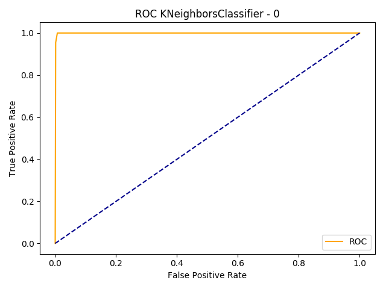
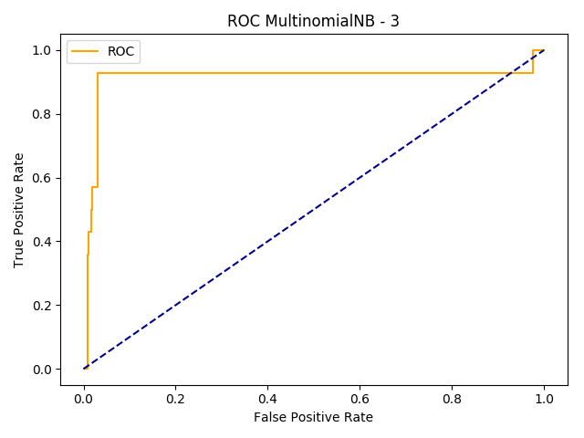
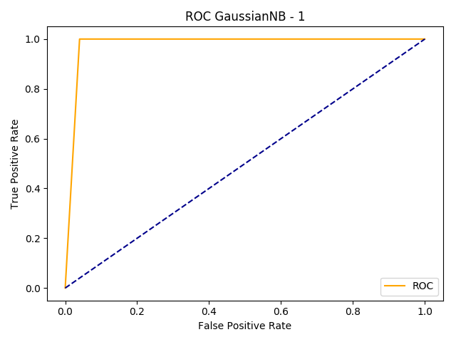
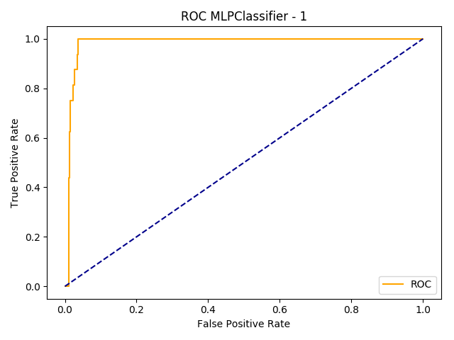

Classifiers comparison
======================

These comparisons have been done using the flows provided at the beginning of the course. Using the SMTP appName and normalisation.

## K Nearest Neighbors classifier
With 5 neighbors 
```
accuracy 0.9977 time 1060ms false_positive    2 false_negative    1 recall 0.9765 prec 0.9561 F1 0.9661 AUC 0.9991 name KNeighborsClassifier-0
accuracy 0.9985 time 1068ms false_positive    1 false_negative    1 recall 0.9496 prec 0.9496 F1 0.9496 AUC 0.9498 name KNeighborsClassifier-1
accuracy 0.9977 time 1081ms false_positive    1 false_negative    2 recall 0.9329 prec 0.9635 F1 0.9477 AUC 0.9665 name KNeighborsClassifier-2
accuracy 0.9992 time 1056ms false_positive    1 false_negative    0 recall 0.9996 prec 0.9583 F1 0.9781 AUC 0.9996 name KNeighborsClassifier-3
accuracy 0.9992 time 1088ms false_positive    1 false_negative    0 recall 0.9996 prec 0.9722 F1 0.9855 AUC 1.0000 name KNeighborsClassifier-4
```

## Multinomial Naive Bayes classifier
```
accuracy 0.9853 time  119ms false_positive    0 false_negative   19 recall 0.5000 prec 0.4927 F1 0.4963 AUC 0.9914 name MultinomialNB-0
accuracy 0.9869 time  122ms false_positive    0 false_negative   17 recall 0.5000 prec 0.4934 F1 0.4967 AUC 0.9302 name MultinomialNB-1
accuracy 0.9915 time  107ms false_positive    0 false_negative   11 recall 0.5000 prec 0.4957 F1 0.4979 AUC 0.9779 name MultinomialNB-2
accuracy 0.9892 time  155ms false_positive    0 false_negative   14 recall 0.5000 prec 0.4946 F1 0.4973 AUC 0.9129 name MultinomialNB-3
accuracy 0.9892 time  134ms false_positive    0 false_negative   14 recall 0.5000 prec 0.4946 F1 0.4973 AUC 0.8551 name MultinomialNB-4
```

## Gaussian Naive Bayes classifier
```
accuracy 0.9938 time  217ms false_positive    6 false_negative    2 recall 0.9476 prec 0.8742 F1 0.9075 AUC 0.9446 name GaussianNB-0
accuracy 0.9606 time  229ms false_positive   51 false_negative    0 recall 0.9800 prec 0.6250 F1 0.6898 AUC 0.9800 name GaussianNB-1
accuracy 0.9590 time  230ms false_positive   53 false_negative    0 recall 0.9794 prec 0.5583 F1 0.5940 AUC 0.9809 name GaussianNB-2
accuracy 0.9590 time  216ms false_positive   53 false_negative    0 recall 0.9792 prec 0.6214 F1 0.6848 AUC 0.9792 name GaussianNB-3
accuracy 0.9606 time  236ms false_positive   51 false_negative    0 recall 0.9801 prec 0.6077 F1 0.6670 AUC 0.9801 name GaussianNB-4
```

## Multi Layer Perceptron classifier
```
accuracy 0.9838 time  318ms false_positive    0 false_negative   21 recall 0.5000 prec 0.4919 F1 0.4959 AUC 0.8567 name MLPClassifier-0
accuracy 0.9876 time  355ms false_positive    0 false_negative   16 recall 0.5000 prec 0.4938 F1 0.4969 AUC 0.9839 name MLPClassifier-1
accuracy 0.9899 time  312ms false_positive    0 false_negative   13 recall 0.5000 prec 0.4950 F1 0.4975 AUC 0.9141 name MLPClassifier-2
accuracy 0.9869 time  490ms false_positive    0 false_negative   17 recall 0.5000 prec 0.4934 F1 0.4967 AUC 0.9884 name MLPClassifier-3
accuracy 0.9938 time  444ms false_positive    0 false_negative    8 recall 0.5000 prec 0.4969 F1 0.4984 AUC 0.9912 name MLPClassifier-4
```
